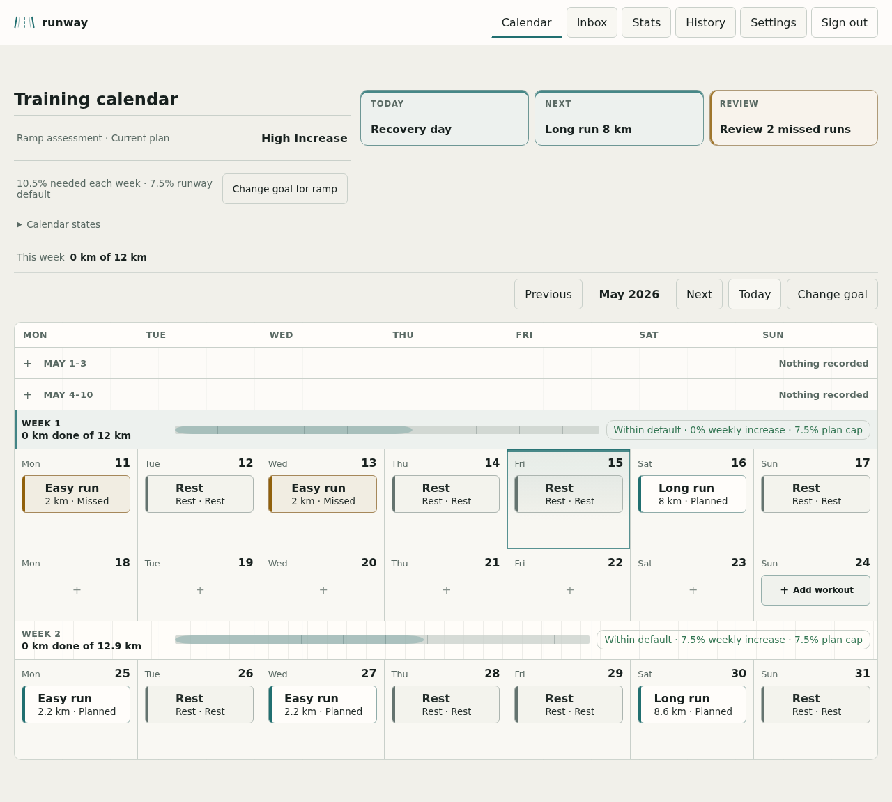
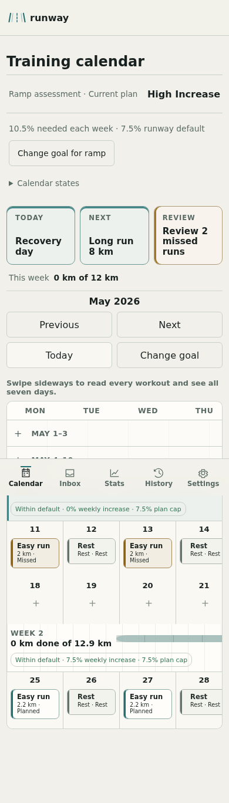
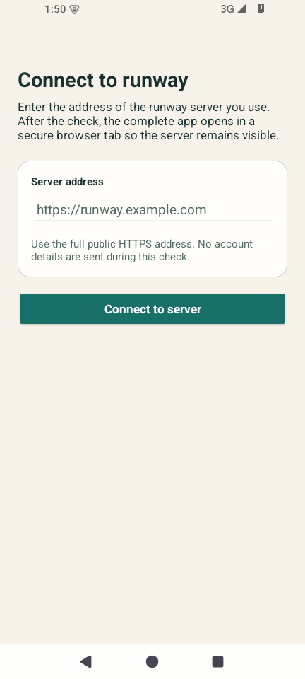
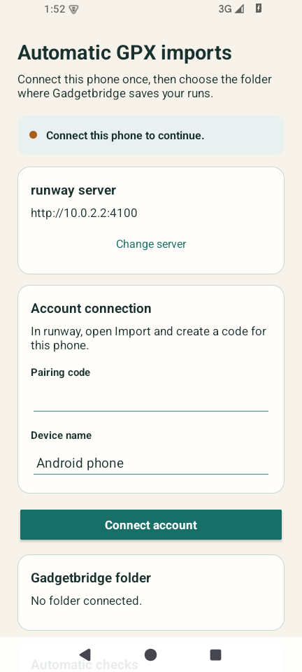
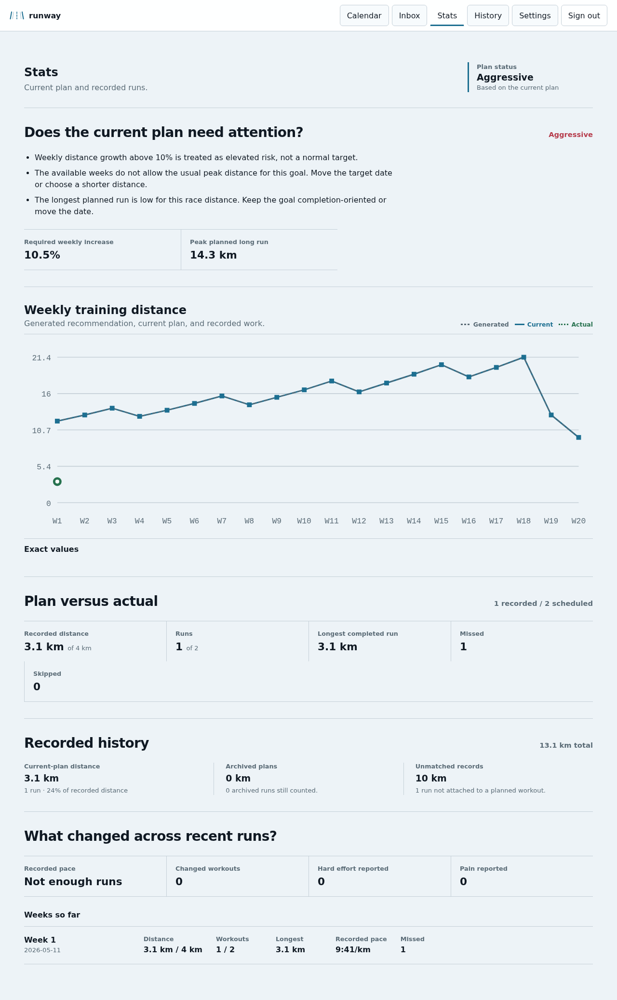
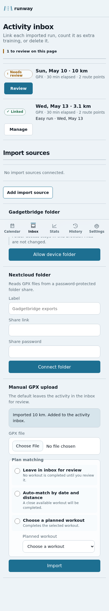

# runway

[](https://github.com/deftmartian/runway/actions/workflows/check.yml)
[](https://github.com/deftmartian/runway/actions/workflows/container.yml)
[](https://github.com/deftmartian/runway/pkgs/container/runway)
[](LICENSE)

**runway is a self-hosted running planner and activity ledger. It keeps the recommendation, the
runner's edits, and the work that actually happened separate—and makes the next decision explicit.**

It is for runners who want a plan they can inspect and change, without handing route, schedule,
heart-rate, pain, or training-history data to a social fitness platform. When a run is missed, moved,
short, long, hard, or unplanned, runway records the facts first and offers a choice before changing
future workouts.

## The product at a glance

| Desktop web                                                                                  | Installed mobile PWA                                                                         |
| :------------------------------------------------------------------------------------------- | :------------------------------------------------------------------------------------------- |
|              |                |
| A month, weekly load, recovery spacing, and the selected day's next decision in one surface. | The same plan and activity record, reflowed around the day rather than reduced to a summary. |

The calendar is the main operating surface. It keeps the recommendation, current plan, actual work,
rest, missed work, recovery spacing, and current review item visible together.

### Android: the complete app plus native folder access

| Connect a self-hosted server                                                          | Configure automatic GPX imports                                                       |
| :------------------------------------------------------------------------------------ | :------------------------------------------------------------------------------------ |
|  |       |
| The universal APK verifies the server before opening sign-in.                         | Native Android retains the approved Gadgetbridge folder and schedules bounded checks. |

The Android package is a complete way to use runway, not a companion. It opens the full web product
in an origin-visible Custom Tab and adds the capabilities the PWA cannot reliably own: durable folder
access, background reconciliation, and Android GPX shares. See [Android architecture](docs/ANDROID.md) and
[build instructions](android/README.md).

Versioned GitHub releases are wired to include a verified, signed APK alongside the container image.
The release is blocked if the protected Android signing identity is unavailable; debug or unsigned
APKs are never presented as installable releases.

<details>
<summary>Plan traces and exact values</summary>



Stats explain whether the current plan needs attention and pair the visual trace with exact values.

</details>

<details>
<summary>Mobile activity inbox</summary>



</details>

The web screenshots come from deterministic visual-regression states. The Android screenshots come
from the built debug APK running on the documented API 35 emulator.

## Ways to run runway

| Surface       | Best for                                           | Capability boundary                                                                                 |
| ------------- | -------------------------------------------------- | --------------------------------------------------------------------------------------------------- |
| Browser       | Any modern desktop or mobile browser               | Complete product; manual, share-target, Nextcloud, and foreground-approved-folder imports.          |
| Installed PWA | Home-screen use with offline shell and OS sharing  | Same complete product; browser folder permission remains browser-managed and is checked while open. |
| Android app   | Self-hosters who want durable Gadgetbridge imports | User-selected HTTPS server, visible browser origin, native folder grant, background checks, shares. |

## What It Does

| Area              | Behavior                                                                                                            |
| ----------------- | ------------------------------------------------------------------------------------------------------------------- |
| Planning          | Builds an editable running plan from an established baseline, a foundation phase, or a short timed calibration.     |
| Calendar          | Shows generated recommendations, the current plan, recorded work, rest, recovery spacing, and week load.            |
| Workout editing   | Moves, changes, adds, removes, resets, and undoes future non-race workouts with a consequence preview.              |
| Activity review   | Accepts manual or GPX activity facts first, suggests possible matches, and leaves ambiguous records for the runner. |
| Activity detail   | Shows a locally rendered route map coloured by relative speed and a heart-rate trace with exact retained samples.   |
| Decisions         | Offers keep, reduce, rest, repeat, or rebalance choices after material deviations; nothing applies until confirmed. |
| History and stats | Preserves plan phases, edits, feedback-driven changes, archived plans, exact values, and plan-versus-actual traces. |
| Ownership         | Runs as a private PWA with local accounts, OIDC, 2FA, passkeys, exports, and configurable source disclosure.        |

### Planning paths

- **Established baseline:** distance planning from a repeatable week of at least 3 km, two runs,
  and a positive longest run.
- **Foundation then goal:** the exact nine-week NHS Couch to 5K schedule before a confirmed
  distance baseline and retained race goal.
- **Foundation only:** the same foundation phase toward 30 minutes of continuous easy running.
- **Calibration:** two identical easy run/walk sessions per week for two weeks, using time instead
  of invented distance.

## Run the Published Container Behind HTTPS

Requirements: Docker Engine with Compose v2 and OpenSSL for generating local secrets.

Start from the documented environment template:

```sh
cp .env.example .env
openssl rand -hex 24
corepack pnpm secret:generate
```

Put the first generated value in `POSTGRES_PASSWORD` and in the password segment of
`APP_DATABASE_URL`. Put the generated `runway-secret-v1_…` value in `BETTER_AUTH_SECRET`. The published image is a production
artifact and deliberately refuses plain-HTTP public origins. The minimum relevant `.env` values are:

```dotenv
RUNWAY_IMAGE="ghcr.io/deftmartian/runway:v0.2.0"
POSTGRES_PASSWORD="<first generated value>"
APP_DATABASE_URL="postgres://runway:<first generated value>@db:5432/runway"
BETTER_AUTH_SECRET="<second generated value>"
ORIGIN="https://runway.example.com"
PUBLIC_APP_ORIGIN="https://runway.example.com"
ALLOW_LOCAL_SIGNUPS="true"
```

Then pull and start the same tested image for migrations, the web app, and the import worker:

```sh
docker compose -f compose.yaml -f deploy/compose.production.yaml pull
docker compose -f compose.yaml -f deploy/compose.production.yaml up -d --wait app worker
docker compose -f compose.yaml -f deploy/compose.production.yaml ps
```

Configure the existing HTTPS reverse proxy with the private runway upstream and header contract in
[`deploy/Caddyfile.example`](deploy/Caddyfile.example), then open the public HTTPS origin. Create the
intended account, set `ALLOW_LOCAL_SIGNUPS="false"`, and apply the change:

```sh
docker compose -f compose.yaml -f deploy/compose.production.yaml up -d --wait app worker
```

The app port is loopback-only by default.

The production overlay pins that listener to loopback even if `RUNWAY_BIND_ADDRESS` is set. When the
reverse proxy runs on another host, use the documented ipvlan overlay plus a firewall rule that
allows only the proxy source; do not expose port `4100` directly to clients.

For a local plain-HTTP evaluation, use the source-based development quick start below at
`http://localhost:4100`; do not weaken the production image's HTTPS checks.

For an update or rollback, change `RUNWAY_IMAGE` to a tested version, full `sha-*` tag, or digest;
run `pull`; then run `up` again. Before changing the database or image, create and prove a private
backup with `corepack pnpm db:backup -- <new-file>` and
`corepack pnpm db:backup:verify -- <file>`. Production deployments should use HTTPS, keep registration
closed, and pin an immutable image reference. The
[deployment guide](docs/DEPLOYMENT.md) covers the full environment contract, reverse proxy, OIDC,
SMTP, imports, backups, and health checks.

## Development Quick Start

Requirements: Node.js 24, pnpm through Corepack, and Docker with Compose.

```sh
corepack pnpm install
cp .env.example .env
corepack pnpm db:start
corepack pnpm db:migrate
corepack pnpm dev
```

Open [http://localhost:4100](http://localhost:4100). The development server binds to
`0.0.0.0:4100`.

To test from another device, set `ORIGIN` and `PUBLIC_APP_ORIGIN` to the address that device uses to
reach the development machine. Set `SITE_URL` to that same address when running `verify:preview`.

Real GPX files contain personal training data. Keep local samples in `samples/` and never commit
them.

## Verification

For the complete local release gate:

```sh
corepack pnpm verify:full
```

The release gate runs independent web, browser, data/deployment, Android, and container groups in
parallel, then checks the completed production build. It uses at most three groups at once by
default; set `RUNWAY_VERIFY_CONCURRENCY=1` or run `corepack pnpm verify:full:serial` when debugging
resource contention.

Focused commands are available for faster iteration:

```sh
corepack pnpm format:check
corepack pnpm verify:docs
corepack pnpm lint
corepack pnpm check
corepack pnpm test:unit
corepack pnpm test:e2e
corepack pnpm test:visual
corepack pnpm verify:migrations
corepack pnpm verify:compose
corepack pnpm verify:compose:production
corepack pnpm verify:dependencies
corepack pnpm verify:image -- runway:local
```

Browser suites allocate an ephemeral PostgreSQL database and preview port, so functional and visual
checks do not share account, rate-limit, or training state. Visual snapshot changes still require
browser and diff inspection.

To verify the built application, start the production preview in one terminal:

```sh
corepack pnpm build
corepack pnpm preview
```

Then run the live checks from another terminal:

```sh
SITE_URL=http://localhost:4100 corepack pnpm verify:preview
```

## Deployment

The tested image is published for AMD64 and ARM64 at:

```text
ghcr.io/deftmartian/runway:latest
```

Every published image also receives `sha-<full-commit-sha>`; release tags receive matching semantic
version tags. Pin a full SHA tag or image digest in production so rollback does not depend on a
moving tag.

The production shape is PostgreSQL plus separate web, migration, and import-worker processes behind
an HTTPS reverse proxy. Authentik OIDC, local username/password, 2FA, passkeys, SMTP password reset,
Nextcloud GPX import, Caddy, and Cloudflare are documented but independently configurable.
Standard Compose deployment uses a loopback-published app port; an optional overlay supports a
dedicated `ipvlan` without making that private network layout a requirement for other installations.
All three runway services use the same image; Compose never builds application containers.

Modified network deployments must set `PUBLIC_SOURCE_URL` to the corresponding source tree. See the
[deployment guide](docs/DEPLOYMENT.md) for the environment contract, Compose layout, key rotation,
health checks, and PWA verification.

## Documentation

- [Product](docs/PRODUCT.md): product boundary, audience, value, planning paths, and non-goals.
- [Design system](docs/DESIGN_SYSTEM.md): visual language, controls, interaction, copy, responsive
  behavior, and visual testing.
- [Architecture](docs/ARCHITECTURE.md): stack, routes, runtime shape, data ownership, training logic,
  and imports.
- [Security](docs/SECURITY.md): auth, privacy defaults, threat model, GPX handling, Nextcloud sync,
  and audit expectations.
- [Deployment](docs/DEPLOYMENT.md): production environment, Authentik, SMTP, Nextcloud, Caddy,
  Cloudflare, and PWA checks.
- [Training sources](docs/TRAINING_SOURCES.md): source-backed training claims and product limits.
- [Contributing](CONTRIBUTING.md): setup, change discipline, privacy rules, and review expectations.

## Current Boundaries

- Watches and phone apps record the activity; runway plans, reviews, and explains consequences.
- HTTP is suitable for local product review. Passkeys, OIDC redirects, secure cookies,
  installability, and offline behavior need the real HTTPS origin.
- Installed Chromium-family PWAs can receive GPX files from the operating-system share sheet or read
  an explicitly approved Gadgetbridge Auto GPX export directory. New records enter review without
  changing the plan automatically.
- Password reset needs `MAIL_ENABLED=true` and SMTP configuration.
- Nextcloud sync expects a password-protected public folder share and an exact-origin production
  allowlist.
- GPX imports keep a bounded route trace and heart-rate series for authenticated activity detail.
  Route retention can be disabled or cleared in Settings, original files are discarded after
  parsing, and maps do not contact an external tile service.
- Training guidance supports planning decisions; it is not medical advice or individualized
  coaching.

## License

Copyright © 2026 runway contributors.

runway is licensed under the [GNU Affero General Public License v3.0 only](LICENSE)
(`AGPL-3.0-only`). Modified versions made available over a network must offer their corresponding
source to users.
