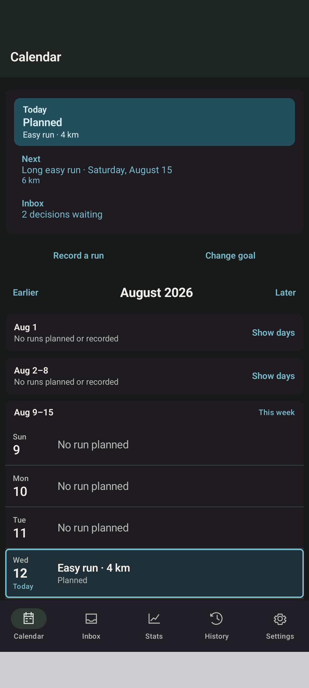
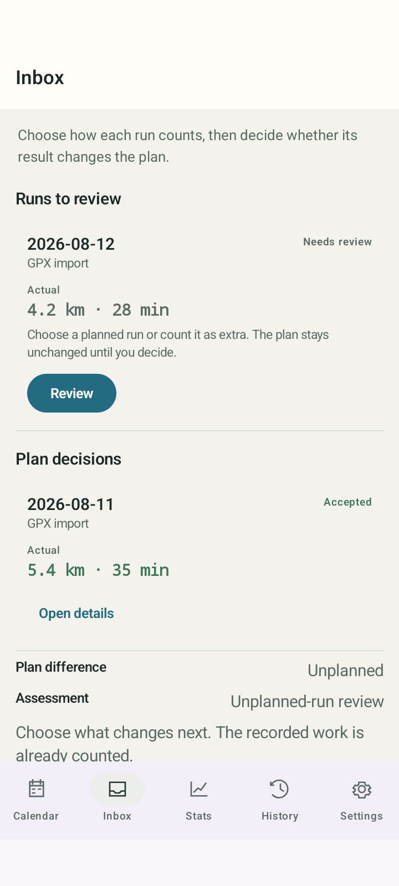
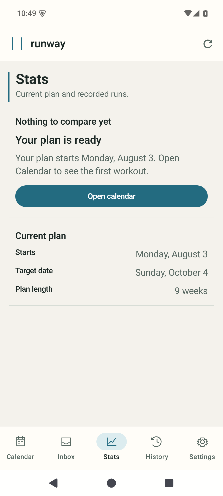
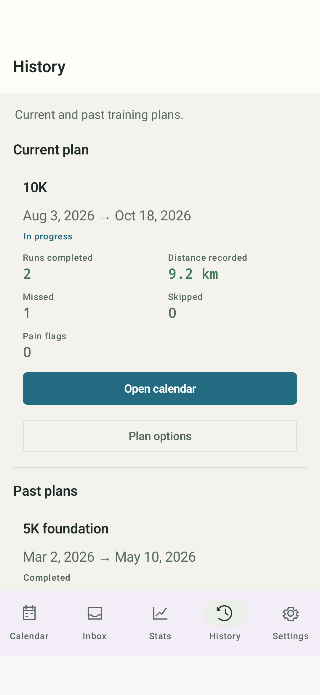
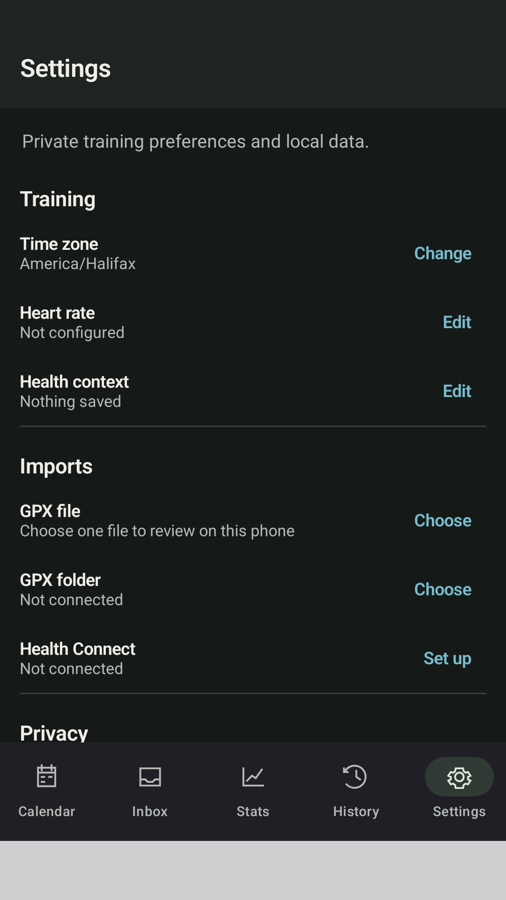
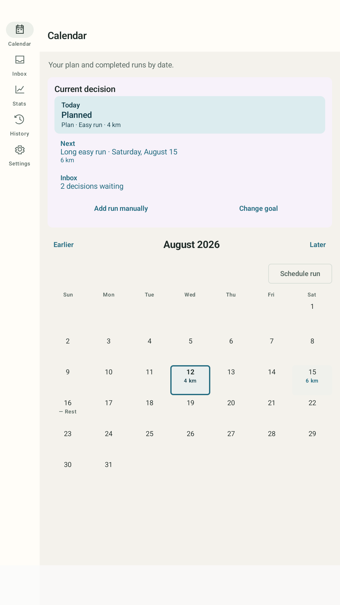

# runway

[](https://github.com/deftmartian/runway/actions/workflows/android.yml)
[](https://github.com/deftmartian/runway/releases/latest)
[](LICENSE)

**A private Android running decision ledger for self-coached runners.**

runway keeps the original recommendation, deliberate edits, and completed work separate. A missed day, short run, extra run, or hard effort is recorded as it happened; future training changes only after the runner reviews and applies a choice.

It is a native Kotlin and Jetpack Compose app for Android 8.0 and newer. The installed ledger and import processing are local, with no account, server, subscription, or cloud sync.

| Calendar | Inbox |
| --- | --- |
|  |  |

## Plan, record, decide

1. Build a conservative plan from a repeatable baseline, a foundation phase, or timed calibration.
2. Move, edit, add, remove, reset, or undo future runs when the schedule changes.
3. Record a run manually, share a GPX file, scan an approved folder, or import an optional Health Connect activity for review.
4. Compare the plan with what happened, then keep, reduce, rest, repeat, or rebalance through an explicit choice.

Calendar, Inbox, Stats, History, and Settings keep the current decision, unresolved review work, training context, past plans, and local controls in predictable places. Rest and recovery remain visible parts of the plan. runway provides decision support, not medical advice.

## Private by design

- GPX files are parsed locally; original input bytes are discarded after intake.
- GPX and optional read-only Health Connect imports enter the Inbox before they can affect completed totals or future decisions.
- A selected GPX folder is scanned when runway returns to the foreground; Android background scans are best-effort, not a continuous folder watch.
- Route and imported heart-rate retention have separate controls. Fresh profiles discard both; switching either control back to discard permanently clears only that type's retained and pending import data.
- Backup and export are explicit plaintext files written to the location chosen in Android's document picker. Create a backup before moving to or resetting a phone, then restore it into runway on the replacement device. These files can contain sensitive training history, notes, routes, and heart-rate data; a cloud-backed document provider can move them off the device.

See [Security and privacy](docs/SECURITY.md) for the full trust boundary and data controls.

<details>
<summary><strong>More screens</strong></summary>

| Stats | History |
| --- | --- |
|  |  |
| Settings | Larger screens |
|  |  |

</details>

## Install

Download the APK with its matching `.sha256` and `.signer.txt` files from the [latest release](https://github.com/deftmartian/runway/releases/latest). Verify the checksum and signing certificate using the [Android release guide](android/docs/RELEASE.md), then open the APK on the device. Releases signed with the same `dev.deftmartian.runway` certificate install as in-place updates.

Personal F-Droid repository operators should follow the [Android release guide](android/docs/RELEASE.md) so GitHub and F-Droid builds preserve the same application identity and update path.

## Build from source

Use JDK 17, Android SDK Platform 36 with matching build tools, and the checked-in Gradle wrapper:

```sh
android/gradlew -p android --no-daemon --max-workers=1 lint test assembleDebug
```

See [Android development](docs/ANDROID.md) for device tests and module responsibilities, or [Contributing](CONTRIBUTING.md) before changing product behavior.

## Documentation

| Topic | Start here |
| --- | --- |
| Product intent and boundaries | [Product](docs/PRODUCT.md) |
| Interface and copy decisions | [Design system](docs/DESIGN_SYSTEM.md) |
| Modules and local data flow | [Architecture](docs/ARCHITECTURE.md) |
| Data sensitivity and trust boundary | [Security and privacy](docs/SECURITY.md) |
| Training evidence and limits | [Training sources](docs/TRAINING_SOURCES.md) |
| Building and testing | [Android development](docs/ANDROID.md) |
| Signing and distribution | [Android release guide](android/docs/RELEASE.md) |

## License

Copyright © 2026 runway contributors.

runway is licensed under the [GNU Affero General Public License v3.0 only](LICENSE) (`AGPL-3.0-only`).
