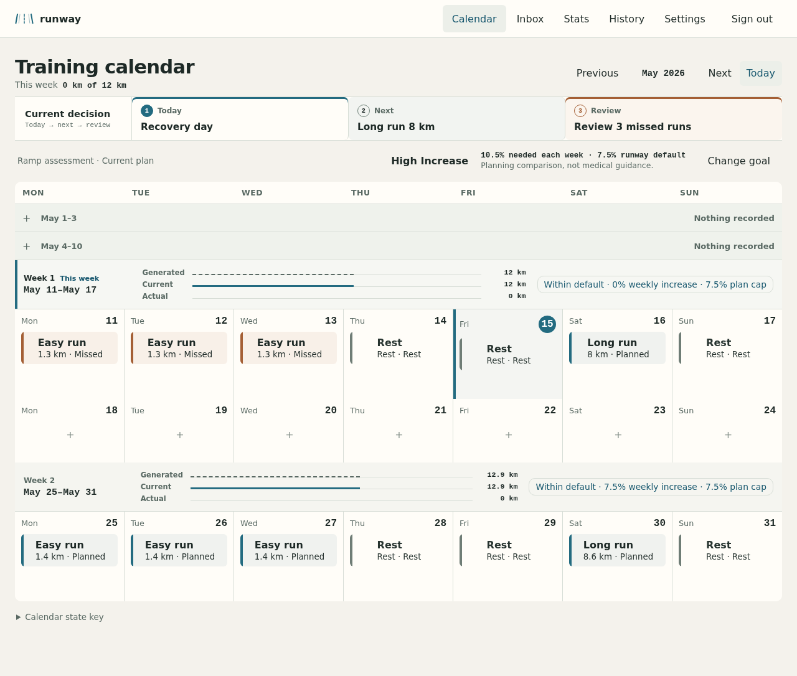
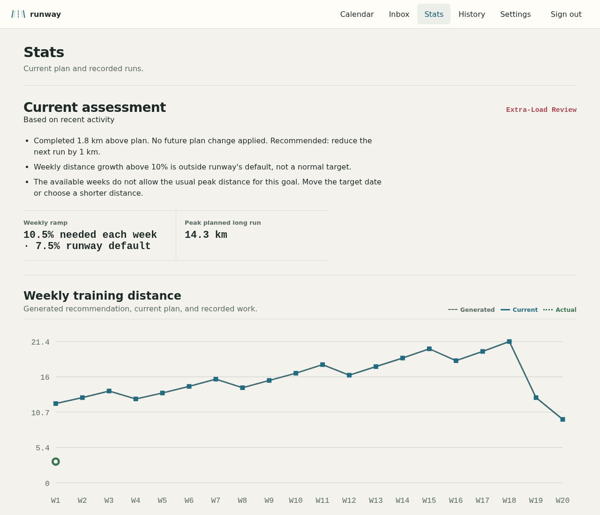
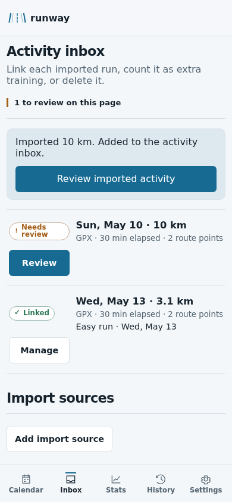

# runway

[](https://github.com/deftmartian/runway/actions/workflows/container.yml)
[](https://github.com/deftmartian/runway/releases/latest)
[](https://github.com/deftmartian/runway/pkgs/container/runway)
[](LICENSE)

**A self-hosted running planner that keeps the recommendation, your edits, and the work you
actually did separate.**

runway is built for the messy part of following a plan. Move a workout. Shorten it. Run farther than
expected. Miss a day. Import an unplanned run. runway records what happened, shows the consequence,
and lets you choose what changes next.



## Plan, run, reconcile

Most training plans describe the ideal week. runway also keeps track of the week you are actually
having:

1. **Build a conservative plan** from an established baseline, a foundation phase, or a short
   timed calibration.
2. **Make it yours** by moving, changing, adding, removing, resetting, or undoing individual
   workouts.
3. **Record the facts** manually or import GPX and supported Health Connect activity data.
4. **Resolve the difference** when a run is missed, moved, short, long, hard, or unplanned. Future
   workouts change only after you confirm the choice.



**Understand the load.** See the current assessment, plan ramp, exact values, and
generated/current/actual traces together.

<p align="center">
  
</p>

<p align="center">
  <strong>Keep imports honest.</strong> Link a run, count it as extra training, or delete it before
  the plan reacts.
</p>

## What runway helps you decide

- **What should I do next?** Today, the next run, recovery spacing, and unresolved review work share
  one calendar.
- **Can I change this workout?** Edits show their effect before anything is saved.
- **What happens when the plan and reality differ?** Keep, reduce, rest, repeat, or rebalance
  choices remain explicit and reversible.
- **Is the plan still reasonable?** Stats pair the training trace with exact values and plainly
  worded risk context.
- **Where did this recommendation come from?** Plan phases, user edits, feedback-driven changes,
  and archived plans stay distinguishable in history.

## Start from where you are

| Planning path         | Intended starting point                                                                                    |
| --------------------- | ---------------------------------------------------------------------------------------------------------- |
| Established baseline  | A repeatable recent week with at least 3 km, two runs, and a completed longest run.                        |
| Foundation, then goal | The nine-week NHS Couch to 5K schedule, followed by a distance plan once a baseline has been established.  |
| Foundation only       | The same foundation phase toward 30 minutes of continuous easy running, without inventing a distance goal. |
| Timed calibration     | Two identical easy run/walk sessions per week for two weeks when distance inputs would be guesswork.       |

The defaults are recommendations, not rules. You can change available days, workout timing,
distance, duration, and the individual runs in the resulting plan.

## Web and Android

| Surface     | What you get                                                                                                                                                                                                 |
| ----------- | ------------------------------------------------------------------------------------------------------------------------------------------------------------------------------------------------------------ |
| Web         | The complete responsive product in a modern desktop or mobile browser: planning, review, history, settings, manual uploads, and Nextcloud import. It is an online client, not an installable or offline PWA. |
| Android app | A first-class Jetpack Compose client for the same account and plan. It adds durable folder access, background imports, GPX shares, and optional Health Connect reads.                                        |

Android is not a browser wrapper or a WebView. It uses the versioned runway mobile API and device
authorization for normal product use. The system browser appears only for deliberate security
boundaries: approving device authorization and fresh account-security actions. Android can read
approved running and treadmill sessions, route samples, heart rate, pace, cadence, elevation, and
related workout metrics from Health Connect. It never writes to Health Connect, and route access is
requested separately. Import setup stays inside the signed-in Android app; there is no pairing code
to copy from the web client.

Each published versioned [GitHub release](https://github.com/deftmartian/runway/releases) includes a
signed universal APK. Release builds fail closed when the protected signing identity is missing or
differs from the pinned certificate. See the [Android architecture](docs/ANDROID.md) and
[Android build guide](android/README.md).

## Private by design

runway is intended for one private deployment, not a social network or hosted SaaS.

- Local accounts, OIDC, 2FA, passkeys, exports, and configurable source disclosure are supported.
- Route traces, heart-rate data, schedule patterns, and workout feedback stay on your server.
- Original import files are discarded after parsing. Route retention can be disabled or cleared.
- Maps are rendered locally and do not contact an external tile service.
- Watches and phone apps record activities; runway plans, reconciles, and explains consequences.
- Training guidance is source-backed decision support, not medical advice or diagnosis.

Read the [security and privacy model](docs/SECURITY.md) before exposing an installation publicly.

## Deploy behind HTTPS

The production shape is PostgreSQL plus migration, web, and import-worker processes behind an HTTPS
reverse proxy. Published AMD64 and ARM64 images are available at:

```text
ghcr.io/deftmartian/runway:latest
```

Production is intentionally fail-closed for invalid secrets, plain-HTTP public origins, incomplete
database migrations, and missing runtime-role isolation. Start with the environment template:

```sh
cp .env.example .env
corepack pnpm secret:generate
corepack pnpm secret:generate
```

Then follow the [deployment guide](docs/DEPLOYMENT.md) for database roles, secrets, immutable image
pins, Caddy or another reverse proxy, backups, first signup, updates, and rollback. All runway
services use the same published image; Compose does not build application containers.

## Develop locally

Requirements: Node.js 24, pnpm through Corepack, and Docker with Compose.

```sh
corepack pnpm install
cp .env.example .env
corepack pnpm db:start
corepack pnpm db:migrate
corepack pnpm dev
```

Open [http://localhost:4100](http://localhost:4100). The development server binds to
`0.0.0.0:4100`.

Real GPX, FIT, and TCX files contain personal training data. Keep private samples outside commits
and never print their coordinates or metadata in logs.

## Verify a change

Run the complete local release gate:

```sh
corepack pnpm verify:full
```

It runs independent web, browser, data/deployment, Android, and container-image groups in parallel.
The host-network-mutating Compose lifecycle check follows the browser group so Chromium cannot lose
in-flight module requests. That lifecycle includes a fresh deployment, an image change, and
idempotent redeploys before the completed production build is checked.
Focused commands remain available for iteration:

```sh
corepack pnpm check
corepack pnpm lint
corepack pnpm test:unit
corepack pnpm test:e2e
corepack pnpm test:visual
corepack pnpm verify:preview
corepack pnpm verify:android:build
corepack pnpm verify:dependencies
```

Browser suites use isolated PostgreSQL databases and ports. Visual snapshot changes still require
browser and diff inspection.

## Read more

- [Product direction](docs/PRODUCT.md)
- [Design system](docs/DESIGN_SYSTEM.md)
- [Architecture](docs/ARCHITECTURE.md)
- [Security and privacy](docs/SECURITY.md)
- [Deployment](docs/DEPLOYMENT.md)
- [Training sources](docs/TRAINING_SOURCES.md)
- [Contributing](CONTRIBUTING.md)

The web screenshots above are generated from deterministic visual-regression states. Native Android
screenshots will be added after an emulator or device pass; see the Android build guide for the
current verification boundary.

## License

Copyright © 2026 runway contributors.

runway is licensed under the [GNU Affero General Public License v3.0 only](LICENSE)
(`AGPL-3.0-only`). Modified versions made available over a network must offer their corresponding
source to users.
