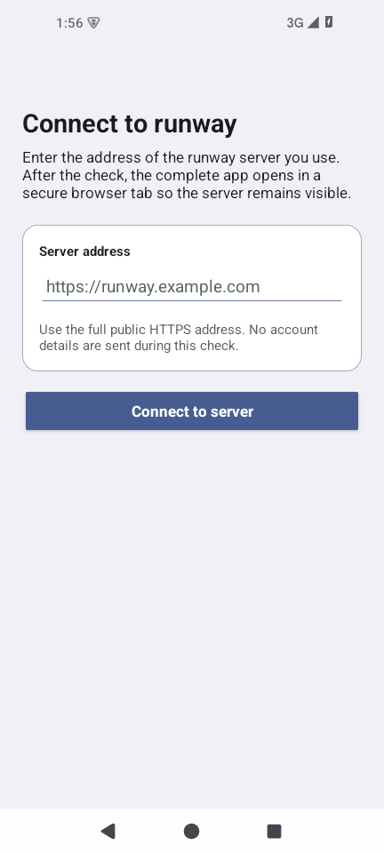
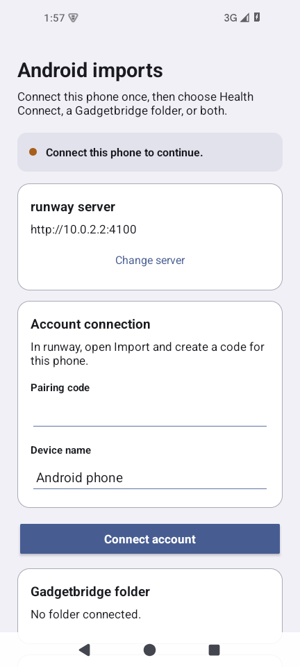

# runway for Android

This project packages the complete self-hosted runway PWA as an Android app. The normal build asks
for the runner's server on first launch, verifies that it is a compatible runway instance, and opens
the full product in a browser Custom Tab. Small native activities own Android-only capabilities:
server selection, persisted Gadgetbridge folder access, scheduled reconciliation, GPX shares, and an
optional running-only Health Connect import.

It is not a separate companion product and it does not reimplement the planning UI. It also does not
use a generic WebView. Every build keeps browser origin controls visible and lets the runner change
servers from the launcher shortcut.

| First launch                                                        | Native import setup                                                         |
| :------------------------------------------------------------------ | :-------------------------------------------------------------------------- |
|  |  |
| Verify one self-hosted origin before sign-in.                       | Pair the phone, approve one folder, and choose background-check behavior.   |

## Build and server model

Every APK uses the same selectable-server model:

```sh
./gradlew \
  :app:testDebugUnitTest :app:lintDebug :app:assembleDebug
```

The runner enters an HTTPS origin on first launch. Android checks `/api/android/instance` before
saving it, follows no redirect, and then uses that exact origin for navigation, pairing, imports, and
shares. Debug builds also accept private-network HTTP for local development. Changing servers first
tries to revoke the old device, then clears its local pairing, folder grant, queued work, and import
markers without touching GPX files or stored activity data. If the old host is offline, the app
requires a second confirmation and says exactly what remains active there.

The canonical source namespace and application id are `dev.deftmartian.runway`. This is the permanent
identity for the deftmartian-signed distribution. An independent operator who changes it must use a
stable, operator-owned id; changing the id or signing key later prevents in-place updates.

## Android capability surface

The normal launcher is the full runway PWA after server selection. Folder settings are available by
long-pressing the runway launcher icon and choosing **Folder** after the first launch. Every build
also exposes **Server**. The native page can be opened with
an explicit package-bound Android intent:

```text
intent://folder#Intent;scheme=runway-native;package=dev.deftmartian.runway;end
```

The native page:

- selects a Gadgetbridge directory with `ACTION_OPEN_DOCUMENT_TREE`;
- retains only the read grant with `takePersistableUriPermission()`;
- scans up to 10,000 direct children from the start without raw filesystem paths, provider-order
  offsets, or broad storage access, and reports when the selected folder exceeds that bound;
- checks on launcher resume, enables unique inexact WorkManager checks, and provides an explicit
  **Check now** action;
- returns directly to the full runway web app.

The exported GPX share activity accepts one `content://` URI, checks its grant/type/size, and reads it
off the UI thread with a 10 MB limit. Names, URIs, XML, coordinates, and metadata are not logged.

## Health Connect runs

After pairing the selected runway server, the Folder screen can request Health Connect access for
running and treadmill-running sessions only. The requested reads are exercise sessions, distance,
heart rate, speed, steps cadence, and elevation gained. runway never writes Health Connect data.
The first foreground sync reads the last 30 days; later syncs use Health Connect changes. Optional
six-hour background sync requires a separately granted background-read permission and never reads
routes. A route needs a separate consent for that specific run while the native screen is open.

The 30-day read follows every provider page. Exact serialized requests are split below 240 KiB and
100 changes, and the provider cursor is saved only after all chunks are accepted while the selected
server and credential are still current. A terminal payload rejection is shown as **Needs
attention** instead of being retried forever.

Health Connect availability and update-required states come from the provider SDK status, not Play
Store, device, or ROM detection. A granted route is sent through the same scoped pairing boundary as
the run summary, but the server retains its trace only when the runner's server-side route privacy
setting permits private route data. Otherwise runway keeps a redacted summary. Imported runs stay in
Review until the runner accepts them; no import silently changes a plan.

## Pairing and imports

Open **Import sources** in the signed-in PWA and create a pairing code. Open the Android **Folder**
screen, enter the code and a device label, then choose the Gadgetbridge directory. The code expires
after ten minutes and works once. Android receives a random, one-year credential limited to device
status, bounded GPX import, and bounded Health Connect changes; runway stores only its hash and the
app encrypts it under an Android Keystore key. It never copies browser cookies or asks for the
account password.

Each folder worker uploads at most one unhandled GPX and prefers the newest provider-dated file. A
manual or periodic trigger can chain up to eight bounded workers while a backlog remains, without
changing Android's 15-minute minimum for periodic scheduling. The Folder screen reports the latest
outcome and a lower bound for files still waiting. Workers require the same bounded content revision
to be observed twice at least 30 seconds apart, so a
provider with missing or unreliable modification times cannot make a partial file terminal. Content
digests are the authoritative handled identity; size plus modification time only accelerates scans,
and weak provider identities are rechecked. Operating-system shares upload the one selected GPX.
Both paths use stable request ids, strict size bounds, and the existing review-only parser. Imported,
duplicate, and terminally rejected content revisions are marked handled locally; network and server
failures retry. Disconnect a device from the PWA if it is lost or no longer trusted. Deleting imported
GPX data revokes all active Android
devices before removing GPX and Health Connect records so background work cannot recreate them.

## Build prerequisites

- JDK 17
- Android SDK platform 36 and matching build tools
- Gradle 8.13 for the initial wrapper generation

The reviewed Gradle 8.13 wrapper is checked in and pins the distribution SHA-256. Keep Android SDK
paths in the ignored `local.properties` file or normal `ANDROID_HOME`/`ANDROID_SDK_ROOT` variables;
do not commit machine-specific paths.

The current compatibility lane is AGP 8.13.2, Gradle 8.13, compile/target SDK 36, and AndroidX Core
1.18.x. AGP 9, Gradle 9, and AndroidX Core 1.19+ are intentionally deferred until they can move
together in a reviewed SDK 37 migration, including AGP's built-in Kotlin transition. Dependabot
continues to propose patch updates inside the current lane.

The committed dependency lock pins every resolved configuration, and Gradle verifies downloaded
plugin and library artifacts against `gradle/verification-metadata.xml`. CI also validates the
wrapper JAR and scans the locked release runtime for moderate-or-higher advisories. When deliberately
changing an Android dependency, regenerate both controls and review every version and checksum change:

```sh
./gradlew --no-daemon \
  --write-locks --write-verification-metadata sha256 \
  :app:dependencies lint test assembleDebug
```

Do not use `--dependency-verification off` to make an unexplained checksum failure pass.

Build with the wrapper:

```sh
cd android
./gradlew --version
./gradlew \
  :app:testDebugUnitTest :app:lintDebug :app:assembleDebug
```

When deliberately upgrading Gradle, regenerate the scripts and JAR together, review the wrapper
change, and replace `distributionSha256Sum` with the checksum published for that exact distribution.
Do not commit `local.properties`, `signing.properties`, signing keys, or signing passwords. Direct
release builds load the required PKCS12 values shown in `signing.properties.example` and fail before
packaging if the external keystore or any value is missing. The explicit F-Droid source-build mode
produces an unsigned release for `fdroid publish` to sign; it refuses a local signing configuration.
The GitHub `android-release` environment also pins `RUNWAY_ANDROID_CERT_SHA256` as a non-secret
environment variable. Set it from the long-lived release certificate before creating a version tag;
CI refuses to publish an APK signed by any other key.

From the repository root, the normal development gate is:

```sh
corepack pnpm verify:android
corepack pnpm verify:android:build
corepack pnpm verify:android:release
```

The first command reviews the static Android/browser/security contract. The second runs Gradle `lint`,
`test`, `assembleDebug`, and `assembleDebugAndroidTest`. The third rejects the removed origin-bound property, rejects an unsigned
normal release, and builds only the explicitly unsigned F-Droid source
artifact without private key material. The build and release gates inspect their merged manifests and
reject operational or Health Connect permissions and exported components outside the reviewed
allowlists. They also assert disabled
backups and release cleartext/debuggable flags. CI runs these exact commands; a green build does not
replace emulator, physical-device, Custom Tab, large-text, or TalkBack checks.

With a disposable emulator or USB test device already online, run the lifecycle instrumentation
checks as well:

```sh
android/gradlew -p android --no-daemon --dependency-verification strict connectedDebugAndroidTest
```

These tests use the real Android Keystore and preferences to prove that an interrupted server-change
journal finishes before state is exposed and that a delayed credential snapshot cannot clear its
replacement. They intentionally change the installed debug app's selected test server, so do not run
them against a debug installation whose local state you need to keep.

Plain `./gradlew test` exercises the only supported shape. Passing `-PrunwayOrigin` is a build error.

See [Android architecture and production gates](../docs/ANDROID.md) and
[release guidance](docs/RELEASE.md).
