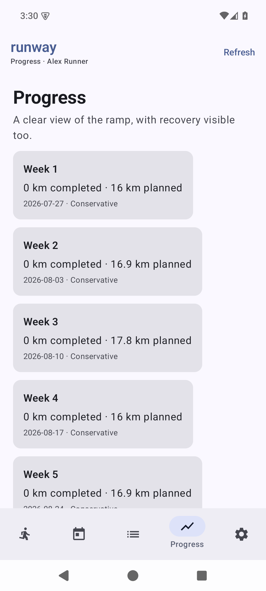

# runway for Android

runway for Android is a first-class native Jetpack Compose client for a self-hosted runway server.
It is not a Custom Tab, WebView, or companion shell. The app owns its navigation and product UI,
while the responsive web client remains a separate, complete way to use runway.

Every APK uses the same selectable-server model. On first launch, the runner enters the HTTPS origin
of their server. Android verifies `GET /api/android/instance` before saving it, follows no redirect,
and binds all sessions, native imports, and local state to that exact normalized origin. Debug builds
also accept private-network HTTP for local development. A server change revokes and clears the old
origin's native state before the new one becomes active; it never changes GPX files or data already
stored on either server.

| Native sign-in                                                                        | Native imports                                                                   |
| :------------------------------------------------------------------------------------ | :------------------------------------------------------------------------------- |
| Choose a server, then approve the device authorization request in the system browser. | Grant a Gadgetbridge folder or Health Connect permissions from Android settings. |

<p align="center">
  
  
</p>

The system browser is deliberately limited to security boundaries. It is used to approve device
authorization and for fresh account-security operations such as passkeys or two-factor changes. It
does not host the runway product UI and Android never copies browser cookies or passwords.

## Android capability surface

The Compose client covers normal planning use: onboarding, today, calendar, workout adjustments,
review, progress/history, settings, and server/account state. It talks to the versioned mobile API
with a Better Auth device-authorization session. User-initiated mutations carry stable idempotency
keys so a retry does not record a run or apply an edit twice.

The presentation layer is typed: one codec translates bounded JSON responses into immutable Kotlin
payloads and sealed commands into mutation bodies. Compose screens and the ViewModel do not consume
`JSONObject` values. Product surfaces and their dialogs live in focused files instead of a single
application-wide screen file.

Android also owns capabilities a responsive web page cannot retain reliably:

- a persisted read-only Storage Access Framework grant for a Gadgetbridge export folder;
- bounded foreground and WorkManager GPX reconciliation;
- an Android share receiver for one bounded GPX file;
- optional, read-only Health Connect import for running and treadmill-running sessions;
- origin-scoped encrypted credentials and server-switch cleanup.

`ACTION_OPEN_DOCUMENT_TREE` supplies a directory URI; runway retains only its read grant and stores
the URI in private app state. Scans inspect up to 10,000 direct children, never request broad storage
or write access, and do not promise filesystem watching. **Check now** is the immediate control;
periodic work is best-effort and subject to Android's scheduling policies. The app uploads at most one
unhandled GPX per worker and preserves a bounded, idempotent local record of handled revisions.

Health Connect import is optional and never writes to Health Connect. With explicit permission it can
read running and treadmill-running sessions plus distance, heart rate, speed, cadence, and elevation.
The first foreground sync reads a bounded recent window; later syncs use provider changes. Background
reading is separately requested. Routes require per-record foreground consent and server-side route
privacy still decides whether a trace is retained. Imported activities enter Review and do not change
a plan automatically.

The signed-in app creates its import connection itself; there is no pairing code to copy from a web
page. The resulting `rwy1_` credential remains limited to background import endpoints. It is
separate from the account session, encrypted under an Android Keystore key, renewable/revocable, and
never used as a general account API key.

## Build prerequisites

- JDK 17
- Android SDK platform 36 and matching build tools
- the checked-in Gradle wrapper

Keep SDK paths in ignored `local.properties` or the normal Android SDK environment variables. Do not
commit `local.properties`, `signing.properties`, signing keys, or signing passwords.

Build from the repository root:

```sh
corepack pnpm verify:android
corepack pnpm verify:android:build
corepack pnpm verify:android:release
```

The static contract and real Gradle build are separate gates. The build command runs lint, unit
tests, debug assembly, and instrumentation assembly. The release contract rejects an unsigned normal
release and verifies the explicitly unsigned F-Droid source-build path without touching an operator's
key material. CI verifies the merged manifest, dependency lock, artifact checksums, and release
signing identity. A green build is not a substitute for emulator, physical-device, large-text, or
TalkBack evidence.

With a disposable emulator or USB device online, run the device checks as well:

```sh
android/gradlew -p android --no-daemon --dependency-verification strict connectedDebugAndroidTest
```

The canonical application id is `dev.deftmartian.runway`. An independently distributed fork must use
its own stable id and signing key; changing either later prevents in-place updates.

## Release model

Versioned GitHub releases publish a signed universal APK only when the protected signing environment
supplies the expected certificate identity. The F-Droid path builds from source and leaves signing to
F-Droid. Before external distribution, record actual install, upgrade, server-switch, device-auth,
folder/Health Connect permission, retry/idempotency, accessibility, and background-behaviour evidence
on the supported devices.

For the protocol and security boundary, see [the Android architecture](../docs/ANDROID.md). For
deployment and server compatibility, see [the deployment guide](../docs/DEPLOYMENT.md).
